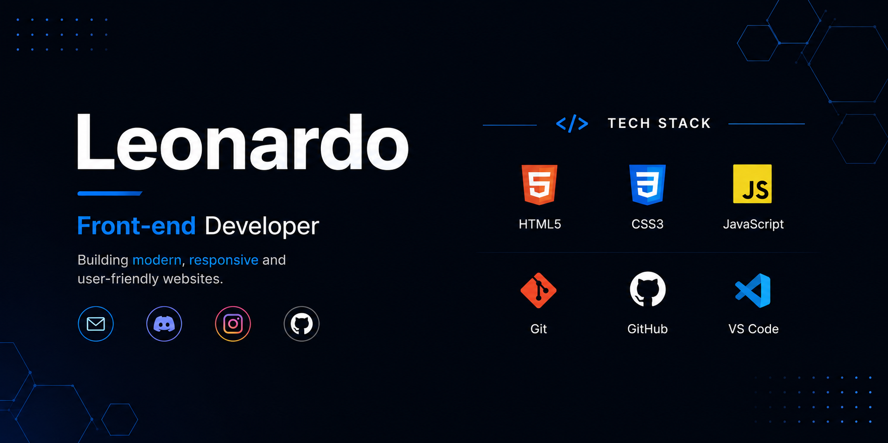

  

---

# Olá, eu sou o Leonardo! 👋

  

  <b>🌐 Escolha o idioma</b>  

  

  

---

# 🚀 Sobre Mim

Sou um desenvolvedor Front-end em evolução, apaixonado por tecnologia e desenvolvimento web.

Gosto de criar sites modernos, aprender novas tecnologias e aprimorar minhas habilidades em programação todos os dias.

Meu objetivo é me tornar um desenvolvedor web profissional e começar a trabalhar como freelancer.

---

# 🛠 Tecnologias

---

# 📚 Atualmente Estudando

- HTML5
- CSS3
- JavaScript
- Git e GitHub
- Design Responsivo

---

# 📊 Estatísticas do GitHub

---

# 🔥 Sequência de Contribuições

---

# 📈 Resumo do Perfil

---

# 🐍 Cobra das Contribuições

---

# 🏆 Troféus do GitHub

---

# 🌐 Conecte-se Comigo

---

# 👀 Visualizações do Perfil

---

### ⭐ Obrigado por visitar meu perfil!

*"Programar não é apenas fazer o código funcionar, é criar algo útil e de qualidade."*

